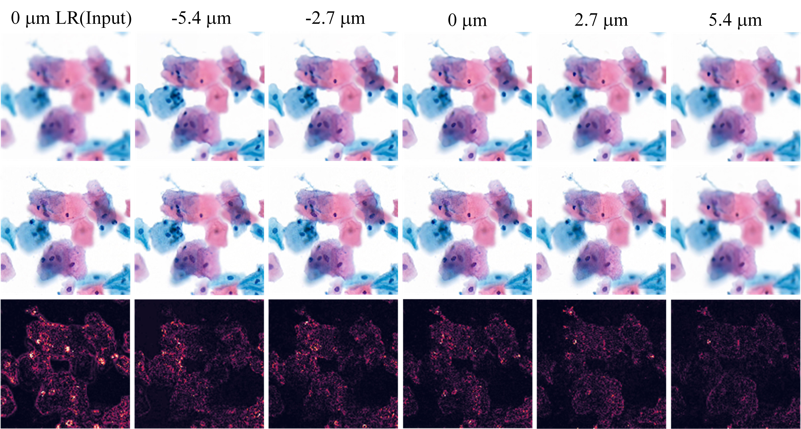

# STSRNet: Self-texture Transfer Super-resolution and Refocusing Network
The implementation of STSRNet.
## Model
Model and toolkits can be found at lib directory. We recommend Pycharm to avoid dependency problems.

## Train
see train.py and for more details. 
## Test
To test the pretrained model, run following instruction: 
```shell
python predict.py
```
## reconstructed samples
one multi-focal-plane image generated by STSRNet.


## DATA
* [百度云盘](https://pan.baidu.com/share/init?surl=S6qVWCsEXC5jcZN6SDWGdA), 提取码：iz73
* [Kaggle](https://www.kaggle.com/birkhoff007/rsdcdata)

## Citation
@ARTICLE{9537813,  author={Ma, Jiabo and Liu, Sibo and Cheng, Shenghua and Chen, Ruixi and Liu, Xiuli and Chen, Li and Zeng, Shaoqun},  journal={IEEE Transactions on Medical Imaging},   title={STSRNet: Self-texture Transfer Super-resolution and Refocusing Network},   year={2021},  volume={},  number={},  pages={1-1},  doi={10.1109/TMI.2021.3112923}}
